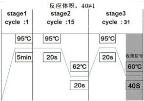

>   **人类 EGFR 基因突变检测试剂盒（荧光 PCR 法）说明书**

【产品名称】
============

>   通用名称：人类 EGFR 基因突变检测试剂盒（荧光 PCR 法）

>   英文名称：Detection Kit for Human EGFR Gene Mutations (Fluorescence PCR)

【包装规格】
============

>   12 测试/盒

【预期用途】
============

>   本产品用于体外定性检测非小细胞肺癌患者石蜡包埋病理组织样本中EGFR基因18\~21外显子上

>   30种体细胞突变。

>   表皮生长因子受体（epidermal growth factor receptor，EGFR）是原癌基因
>   C-erbB-1（HER-1）的表达产物。EGFR 基因位于人类 7 号染色体的短臂上，由 28
>   个外显子组成，编码分子量为 170kD
>   的跨细胞膜糖蛋白，胞内区具有酪氨酸激酶（tyrosine
>   kinase，TK）活性，可以将胞外的信号传递到胞内，引起基因转录水平的增加，使细胞增殖、转化。异常的
>   EGFR
>   活化会促进肿瘤细胞的增殖、分化、血管新生，抑制肿瘤细胞的凋亡。因此，EGFR
>   信号传导的异常是导致多种肿瘤发病的原因[1-2]。

>   肺癌是世界范围内最常见的恶性肿瘤之一。在我国，肺癌的发病率逐年上升，已经成为恶性肿瘤中致死率最高的癌症。非小细胞肺癌（non
>   small cell lung cancer，NSCLC）占肺癌总数的 80%-85%，
>   与小细胞肺癌相比，非小细胞肺癌细胞生长分裂较缓慢，扩散转移相对较晚，尽管手术和化疗技术有了很大的提高，但当人们被确诊为
>   NSCLC 时
>   70%已属晚期，难以通过手术和放疗进行根治性治疗。随着肿瘤分子生物学的发展，靶向治疗备受关注，EGFR
>   基因是非小细胞肺癌患者治疗的重要靶点

>   [3-6]。

>   EGFR 基因的突变主要发生在外显子 18\~21
>   上。研究表明，这些突变与酪氨酸激酶抑制剂（tyrosine kinase
>   inhibitions，TKIs）类药物的用药相关。EGFR 突变类型目前发现的已经有 30
>   多种，绝大多数突变都集中在 21 外显子的 L858R 点突变和 19
>   外显子的缺失突变，19 外显子的缺失约占突变总数的

>   45%；21 外显子的 L858R 占突变总数的 40\~45%；18 外显子的
>   G719X（G719A、G719S、G719C） 占突变总数的 5%。这些突变均为药物敏感性突变。20
>   外显子上的 T790M
>   点突变和插入突变则为耐药性突变[7-9]。本公司研发的试剂盒主要针对的是国内市场，所以专门针对中国人群中
>   EGFR 的突变率进行突变位点的选择（详见附表 1）。

【检测原理】
============

>   本试剂盒采用ARMS-PNA技术，结合荧光PCR平台，检测人类EGFR基因上的30种不同的突变。

>   PNA又叫肽核酸，是一种比DNA特异性更强的探针，它的Tm值很高，在退火时先和野生型DNA模板结合，能阻断大部分野生型DNA片段的扩增。ARMS技术则是利用PCR引物的3’端具有高特异性，如果引物的3’端和模板不匹配，则难以进行延伸。在引物设计的时候，将引物的3’端设计的与野生型片段不匹配，和突变型片段匹配，从而专一的扩增突变型DNA片段。本试剂盒将这两种技术结合起来，
>   最低可以检测到10ng基因组背景下突变含量为1%的DNA样本。

>   本试剂盒同时设计了内控和外控基因检测体系，内控基因检测体系和突变位点检测体系位于同一管中。为避免内控信号影响突变信号的收集，突变位点检测体系的探针采用荧光较强的FAM荧光基团；而内控基因检测体系的探针则采用荧光较弱的JOE/VIC荧光基团。内控基因检测体系用于排除
>   因漏加样本而导致的假阴性检测结果。外控基因检测体系则是设计在不含EGFR突变的EGFR基因外显子上，设计的是单通道的检测体系，从而避免双通道之间的信号干扰。外控基因检测体系用于评估待测DNA的质量，同时还用于判定检测结果的阴阳性，从而排除因DNA浓度过低而导致的假阴性检测结果，或因DNA浓度过高而导致的假阳性检测结果。

 【主要组成成份】
====================

>   本产品由以下成分组成：EGFR 8 联 PCR 反应条、热启动 Taq DNA 聚合酶和 EGFR
>   阳性对照。试剂盒的组成规格和成分见表 1。

>   试剂盒的检测体系采用 EGFR 8 联 PCR 反应条设计，每一个 EGFR 8 联 PCR
>   反应条检测一个样品。EGFR 8 联 PCR 反应条管身标有数字 1-8 或 A-H，分别装有
>   1-8 号检测体系。管盖上标有数字或字母 A 的一头对应 1
>   号检测体系。各检测体系所检测的突变位点和荧光信号见表 2。

>   本试剂盒不包含用于核酸提取的试剂组分， 推荐使用武汉海吉力生物科技有限公司

>   （HGN-tq0850）的试剂盒提取 DNA。不同批号试剂盒中各组分不能互换。

>   表 1 试剂盒组成

| 名称                 | 规格                  | 成分                                     |
|----------------------|-----------------------|------------------------------------------|
| EGFR 8 联 PCR 反应条 | 35μl/管（不含矿物油） | 含有 200nM 特异性引物，100nM 探针，250nM |
| 热启动Taq DNA 聚合酶 | 33μl/管×1 管          | 含有 5U/μl 热启动 Taq DNA 聚合酶         |
| EGFR 阳性对照        | 45μl/管×1 管          | 含有 EGFR 基因的 8 种质粒各 103copies/μl |

>   ×12 条

>   肽核酸，200μM dNTP，2×PCR 缓冲液，20μl 矿物油和超纯水

>   表2 8联PCR反应条的组成

| 8 联 PCR 反应条编号 | 检测体系 | 荧光信号     |
|---------------------|----------|--------------|
| 1 或 A              | G719X    | FAM，JOE/VIC |
| 2                   | 19del    | FAM，JOE/VIC |
| 3                   | T790M    | FAM，JOE/VIC |
| 4                   | S768I    | FAM，JOE/VIC |
| 5                   | 20ins    | FAM，JOE/VIC |
| 6                   | L858R    | FAM，JOE/VIC |
| 7                   | L861Q    | FAM，JOE/VIC |
| 8 或 H              | 外控     | FAM          |

【储存条件及有效期】
====================

>   本试剂盒须避光储藏在-20±2℃，有效期为12个月。

>   本试剂盒须在冷冻条件下运输，抵达目的地时应仍处于冷冻状态。本试剂盒经过9次反复冻融后
>   实验结果无差异，但应避免不必要的冻融。

【适用仪器】
============

>   ABI系列荧光定量PCR仪（ABI7300，ABI7500，ABI
>   ViiA7）；罗氏荧光定量PCR仪（LightCycler

>   480）；安捷伦荧光定量PCR仪（Mx3000P）。

【样本要求】
============

1.  检测所用样本类型为石蜡包埋病理组织或切片，请选择保存尚未超过3年的样品。

2.  样本采集时，应尽可能多的采集含有癌细胞的组织，样本中癌细胞的含量应不低于整个样本的

>   30%。含有较大组织块的蜡块建议切取10μm厚的切片3\~5片，较小组织或穿刺组织则建议切取

>   10μm厚的切片10片。

1.  样本提取过程中，蛋白酶 K 消化步骤建议过夜，可以提高 DNA 的提取量。提取完的
    DNA
    建议立即进行检测，否则应于-20℃以下保存，在冷冻条件下运输，保存时间不要超过 6
    个月。

2.  所提 DNA 应用紫外分光光度计测定纯度和浓度，其 OD260/OD280 应在 1.7～2.1
    内。由于样本来源不同，提取的 DNA
    浓度差别较大，根据紫外分光光度计的定量结果，将待测样本浓度稀释到
    2\~10ng/μl，待用。

 【检验方法】
================

>   进行实验操作的PCR实验室应具有3个不同的分区，分别为试剂准备间、样本提取间和扩增间，3
>   个分区应存在压力差，其压差应满足：试剂准备间＞样本制备间＞扩增间。3个分区应使用单独、专
>   用的移液器和滤芯枪头，以免造成环境污染。

1.  在试剂准备间取一支超纯水用于试剂盒的阴性对照。

2.  在样本制备间取出EGFR阳性对照，先解冻再振荡混匀。然后将8联PCR反应条、热启动Taq
    DNA

聚合酶和EGFR阳性对照快速离心。

1.  在样本制备间将10个待测样品DNA、超纯水和EGFR阳性对照各取40μl，分别加入4μl
    热启动Taq DNA聚合酶（由于热启动Taq
    DNA聚合酶为粘稠状液体，为保证加入足量，加入后应用移液器轻轻抽吸润洗），在涡旋器上混匀10秒，然后快速离心10秒。轻轻揭开8联PCR反应条的条盖，将混好的DNA样品、阴性对照（NTC）和阳性对照（STD）按照表3中建议的顺序依次取5μl加入8联PCR反应条。小心盖上8联PCR反应条管盖，离心。（注意：STD由于含有质粒，
    容易对环境产生污染，应在标本制备间的生物安全柜里进行操作，操作过STD的生物安全柜不得用于操作待测样本和NTC。）

2.  在扩增间将8联PCR反应条放入实时PCR仪器，PCR反应板布局见表3中推荐方法。

>   表3 PCR仪96孔板建议布局

| 检测体系 | 1      | 2      | … | 9      | 10      | 11  | 12  |
|----------|--------|--------|---|--------|---------|-----|-----|
| G719X    | 样品 1 | 样品 2 | … | 样品 9 | 样品 10 | NTC | STD |
| 19del    | 样品 1 | 样品 2 | … | 样品 9 | 样品 10 | NTC | STD |
| T790M    | 样品 1 | 样品 2 | … | 样品 9 | 样品 10 | NTC | STD |
| S768I    | 样品 1 | 样品 2 | … | 样品 9 | 样品 10 | NTC | STD |
| 20ins    | 样品 1 | 样品 2 | … | 样品 9 | 样品 10 | NTC | STD |
| L858R    | 样品 1 | 样品 2 | … | 样品 9 | 样品 10 | NTC | STD |
| L861Q    | 样品 1 | 样品 2 | … | 样品 9 | 样品 10 | NTC | STD |
| 外控     | 样品 1 | 样品 2 | … | 样品 9 | 样品 10 | NTC | STD |

1.  打开仪器窗口，按照下列程序进行设置。

【检验结果的解释】
==================

1.  仪器参数的设置：将校正荧光参照设置为“none”。仪器的基线范围建议手动调节，起始循环数
    设置为1，终止循环数设置为第一个荧光信号出现对数增长期的前3个循环。仪器的阈值也建议
    手动调节，用户可以根据实际情况设置为荧光信号出现对数增长期的拐点处。

2.  阴性对照（NTC）的1-7（或A-G）号孔的FAM信号的CT值应大于30。若其CT值小于30，说明
    环境中可能存在EGFR突变污染，此次实验结果无效，建议换个环境重做。若1-7（或A-G）号
    孔的JOE/VIC信号及8（或H）号孔的FAM信号偶尔升起，不影响对突变检测结果的判断。

3.  阳性对照（STD）检测结果的FAM信号CT值应符合10≤CT≤20，JOE/VIC信号（内控）CT值

＜25。若阳性对照的CT值不在此范围内，表明试剂盒的性能变差，此次实验结果无效，应换
新的试剂盒重做。

1.  外控反应孔（EGFR 8联PCR反应条的第8孔）的FAM信号Ct值应符合10≤CT≤25。若外控的

Ct值＜10，说明加入的DNA过量，应减少DNA加入量再做。若外控的Ct值＞25，说明加入的

DNA含有PCR抑制剂或DNA加入量过少，应增加DNA加入量或重新提取DNA后再做。

1.  内控反应孔的JOE/VIC信号应升起，若内控的CT值不升起则表明此反应孔漏加了DNA，此样
    本应重新检测。

2.  若试剂盒的检测结果满足2\~5项要求，则可以对检测结果进行判读。由于石蜡切片样品在处理过程中DNA断裂严重，用紫外定量的值和实际可扩增片段不同，仅用CT值很难判断结果，因此本试剂盒采用ΔCt值来判断样本的结果。每个样本检测完成后均有7个检测体系对应的突变信号（FAM）CT值和内控信号（JOE/VIC）CT值，还有1个外控信号（FAM）CT值。若突变信号CT值＞30，则检测结果为阴性。若突变信号CT值≤30，则应计算检测体系与外控体系FAM
    信号之间的△CT值，按照表4中△CT值的范围判断检测结果。EGFR基因的突变分布在18\~21，

4个外显子上，因此可能存在多种突变共存的情况。

△CT值=突变信号CT值（FAM）－外控信号CT值（FAM）。

>   表4 结果判定

| 检测体系 | G719X    | 19del | T790M | S768I | 20ins | L858R | L861Q |      |
|----------|----------|-------|-------|-------|-------|-------|-------|------|
| 阳性     | ΔCt值    | ＜8   | ＜9   | ＜10  | ＜8   | ＜7   | ＜9   | ＜8  |
|          | 突变含量 | ≥1%   | ≥1%   | ≥1%   | ≥1%   | ≥1%   | ≥1%   | ≥1%  |
| 阴性     | ΔCt值    | ≥8    | ≥9    | ≥10   | ≥8    | ≥7    | ≥9    | ≥8   |
|          | 突变含量 | ＜1%  | ＜1%  | ＜1%  | ＜1%  | ＜1%  | ＜1%  | ＜1% |

【检验方法的局限性】
====================

1.  本试剂盒仅用于体外诊断使用，仅供临床参考，不可作为诊治的唯一依据。

2.  阴性结果不能完全排除靶基因突变的存在，样本中肿瘤细胞过少、过度降解、突变类型不在试
    剂盒检测范围内或扩增反应体系中靶基因浓度低于检测限亦可造成假阴性结果。

3.  不合理的样本采集、转运及处理、以及不当的实验操作和实验环境均有可能导致错误的结果。

4.  本试剂盒仅用于检测保存年限不超过3年的非小细胞肺癌石蜡组织样品，超过3年的石蜡组织样
    本，其提取的DNA的检测能力不能按照本说明进行。

【产品性能指标】
================

1.  检测10份企业阴性参考品，阴性参考品检测的符合率为100%。

2.  检测90份企业阳性参考品，阳性参考品检测的符合率为100%。

3.  可以检出2ng/μl的人基因组DNA中突变含量为1%的企业灵敏度参考品。

4.  分别对30种EGFR基因突变类型中1%浓度的弱阳性精密度参考品重复检测20次，检测结果均为
    阳性；分别对7种EGFR突变类型中100%浓度的强阳性精密度参考品重复检测20次，检测结果均为阳性，且各检测体系的CT值符合CV＜5%。

5.  本试剂盒对其他具有同源性、易引起交叉的7个EGFR突变进行检测，检测结果均为阴性。

6.  本试剂盒采用Sanger测序法进行比对，对3家医院共1054例非小细胞肺癌样本进行临床实验，
    实验结果显示，两种方法的阴性符合率为95.51%，阳性符合率为95.00%，总符合率为95.26%，
    一致性系数（Kappa）为0.91。

 【注意事项】
================

1.  实验前请仔细阅读本说明书。本试剂盒所有试剂均经过特别配制，用于上述检测。随意替换试
    剂盒中的任何试剂，都可能影响使用效果。使用过的试剂盒为临床废弃物，应该妥善处理。

2.  所有化学药品都具有潜在的危险性。只有经过培训，具有相应实验室技术的人员才能使用本试
    剂盒。操作时，请穿着合适的实验室工作服、并佩戴一次性手套。

【参考文献】
============

1.  Jin W, Chen BB, Li JY, et al. TIEG1 Inhibits Breast Cancer Invasion and
    Metastasis by Inhibition of Epidermal Growth Factor Receptor (EGFR)
    Transcription and the EGFR Signaling Pathway[J]. Molecular and Cellular
    Biology, 2012, 32: 50-63.

2.  Zhou XK, Li J, Wang Z, et al. Cellular Immunotherapy for Carcinoma Using
    Genetically Modified EGFR-Specific T Lymphocytes1,2[J]. Neoplasia, 2013,
    15(5):544-553.

3.  Hirsh V. Review of the treatment of metastatic non small cell lung
    carcinoma: A practical approach[J]. World Journal of Clinical Oncology,
    2011, 2(6): 262-271.

4.  Bayraktar S, Rocha-Lima CM. Molecularly targeted therapies for advanced or
    metastatic non-small-cell lung carcinoma[J]. World Journal of Clinical
    Oncology, 2013, 4(2): 29-42.

5.  Nguyen KH, Neal JW. First-line treatment of EGFR-mutant non-small-cell lung
    cancer: the role of erlotinib and other tyrosine kinase inhibitors[J].
    Biologics: Targets and Therapy, 2012, 6: 337-345.

6.  Berardi R, Santoni M, Morgese F, et al. Novel small molecule EGFR inhibitors
    as candidate drugs in non-small cell lung cancer[J]. OncoTargets and
    Therapy, 2013, 6: 563-576.

7.  Li Y, Li YW, YANG T, et al. Clinical Significance of EML4-ALK Fusion Gene
    and Association with EGFR and KRAS Gene Mutations in 208 Chinese Patients
    with Non-Small Cell Lung Cancer[J]. PLoS ONE, 2013, 8(1): 1-12.

8.  Bai H, Wang ZJ, Wang YY, et al. Detection and Clinical Significance of
    Intratumoral EGFR Mutational Heterogeneity in Chinese Patients with Advanced
    Non-Small Cell Lung Cancer[J]. PLoS ONE, 2013, 8(2):1-7.

9.  Antonicelli A, Cafarotti S, Indini A, et al. EGFR-Targeted Therapy for
    Non-Small Cell Lung Cancer: Focus on EGFR Oncogenic Mutation[J].
    International Journal of Medical Sciences, 2013, 10(3): 320-330.

>   【生产企业】武汉海吉力生物科技有限公司

>   注册地址：武汉东湖技术开发区高新大道858号生物医药园二期A82-1栋生产地址：武汉九龙生物产业基地生物医药产业中小企业园
>   A2-2 栋 2 层电话：027-59590066 传真：027-59590099 邮编：430075

>   网址: [www.](http://www/) hygeianey.com
>   [E-mail:sales\@hygeianey.com](mailto:sales@hygeianey.com)

>   【医疗器械生产企业许可证编号】鄂食药监械生产许20120556号

>   【产品标准编号】YZB/国 2965-2014

>   【医疗器械注册证书编号】国食药监械（准）字2014第3400973号

>   **附表 1** 本试剂盒能够检测的 EGFR 基因突变类型
